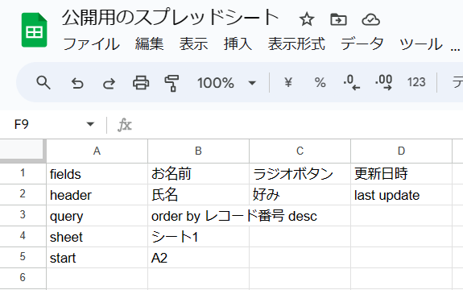

# これは何

kintoneのレコードをGoogleスプレッドシートに流し込むライブラリです。
スプレッドシート用のGASとして、下記のコードと一緒に適用することでご利益が得られます。

```javascript
// kintone の設定
const KINTONE_SUBDOMAIN = '<SUBDOMAIN>';    // ① kintone サブドメイン、xxxx.cybozu.comのxxxx部分を設定してください。
const KINTONE_APP_ID = '<APP ID>';          // ② kintone アプリID
const KINTONE_API_TOKEN  = PropertiesService.getScriptProperties().getProperty("API_TOKEN");    // ③ kintone APIトークンは読み取り権限だけでOKです。スクリプトプロパティにAPI_TOKENキーで登録してください。


function run(){
  KintoneAccessorLib.fetchAndPaste(
    KINTONE_SUBDOMAIN
    , KINTONE_APP_ID
    , KINTONE_API_TOKEN
    , "管理用"      // 設定値を書き込んだシート名です。
  )
}
```

## 簡単な使い方（分かる人用）

以下のIDでライブラリを検索して、バージョン16以降をご利用ください。

 ID: 144KrHx0lWnzZAARnKZM3X2-A4Q4xrN9UbpZEhsNI9hwm9eXbx4tj33df

# 設定シートの書式



```
fields	お名前	ラジオボタン	更新日時
header	氏名	好み	last update
query	order by レコード番号 desc		
sheet	シート1		
start	A2		
```

- fields
    - kintoneのフィールド名を列挙してください
- header
    - kintoneのフィールド名をスプシ上に表示する際の見出しを列挙してください
- query
    - スプシに表示したいkintoneレコードの絞り込み条件を記入してください
    - REST APIに投げるクエリ記法がそのまま使えます。（そのまま投げてます）
    - デフォルトは空欄です。
- sheet
    - kintoneから取得したレコード情報を流し込むシート名を指定してください。
    - デフォルトは"シート1"です。
- start
    - 流し込みの起点となるセル位置を指定してください。
    - デフォルトはA1です。

# GASの設定方法
適宜ChatGPTにお尋ねください。
